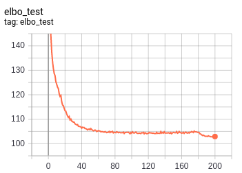

Implementation of Categorical VAE in TF 2

## Categorical VAE

This repo contains implementation of a simple VAE with categorical (factorial)
latent space, based on E.Jang et.al."Categorical Reparameterization with Gumbel-Softmax".
Both encoder and decoder are ffwd NN. Reparameterized samples from the encoder are obtained
using Gumbel-Softmax relaxation.   


## Running the code

```
python train.py
```

## Tensorboard

```
tensorboard --logdir ./logs/
```

## Results

Below plots show ELBO and importance-weighted log-likelihood measured with 100 samples:




